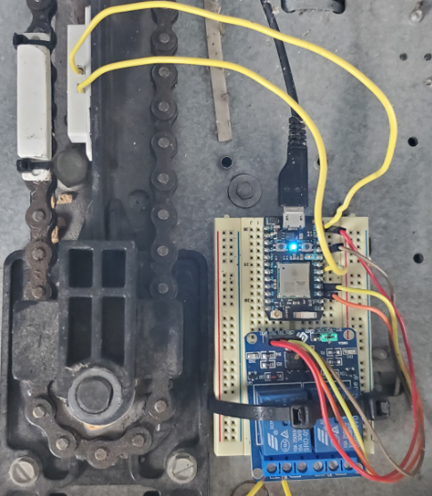

# Photon-MQTT-Garage-Door-Controller

This project allows you to control your garage door via Home Assistant, MQTT and a Particle Photon microcontroller.

# Supplies
  * A Particle Photon microcontroller
  * A compatible relay (this code uses a single relay, but more could be incorporated)
  * A device running Home Assistant (in my case, a Raspberry Pi 3)
  * A MQTT broker (in my case, Mosquito running on my Synology NAS)
  
# Setting up your controller and relays

# Flashing your controller

# Testing your controller

# Integrating your Photon and your garage door

# Setting up and testing your MQTT broker

# Adding your MQTT broker to Home Assistant

# Configuring Home Assistant
